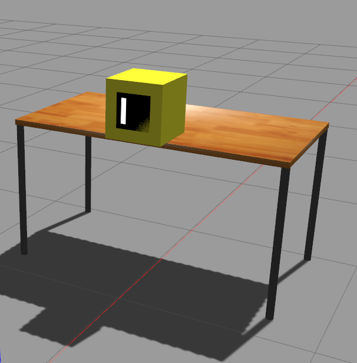

# ArucoBoxes

Gazebo world with table, some boxes and even a container somewhere.



## Instructions
Modify the files as necessary. It can be a bit a mess to understand but 
I trust your capacities. Anyway some suggestions:

- Check `load_table_cubes.launch` for what to spawn. There are multiple boxes with some params. Check the `marker_` for aruco marker usage. 
  - `marker_id` is important: the mesh is taken from `urdf/aurco_visual_marker_x` so put a number which is present. Additional can be found at https://github.com/joselusl/aruco_gazebo
  - `marker_pos` is where the marker is attached. At the moment it always put on the front face in these positions: can be 0 (north west) 1 (north center) or 2 (center). Note that there is also a commented part to put an additional marker on the center of the top face.

- In the `main.launch`, a script is used to publish the trasnformation (ros tf) of each element from world to root link of the element, taking it from what gazebo says (ie the ground truth). :
  ```xml
    <node name="box_pose_gazebo_to_tf" pkg="iit_gazebo_worlds_pkg" type="pose_gazebo_to_tf.py" output="screen" 
          args="--reference world --models table box1 box2 container --models_link surface box1 box2 container --ignore_roslaunch_added_param" />
  ```
  Put the names of the object accordingly. Alternative put `<arg name="pub_box_data" value="false" />` to true to have a node for each element (with is not so nice).

**Not tested** outside my workspace, so some path can be wrong, sorry.
