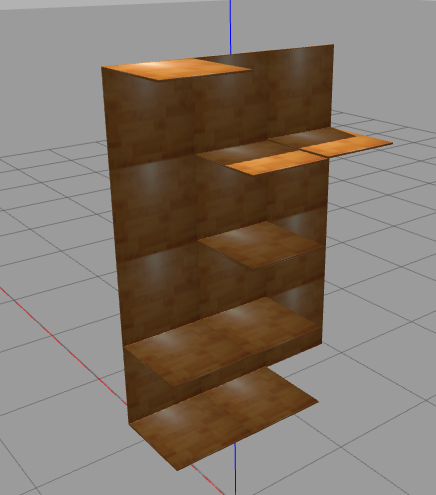
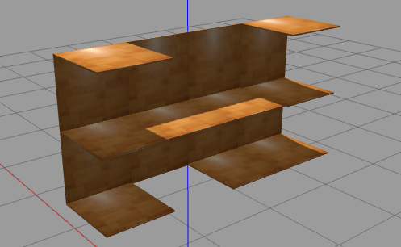
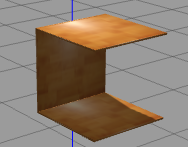

# Shelf Panel
Parametrized shelf panel to replicate the manipulation panel we have in the lab

### Some example

### Description
The entire shelf is a "matrix" of single panels. Each panel has always a "vertical" piece and two optional "horizontal" pieces on top and on bottom:

  
*here both optional are present*  

number of single panels can be set as row-by-column

Check the [xacro](./urdf/shelf.urdf.xacro) for descriptions about the parameters.  
The panels size can be changed (also the thickness)  

### Usage
- Modify the xacro and/or use roslaunch argument as your needs  
- Generate the urdf and load into gazebo, check the [launch](./launch/spawn_shelf.launch) as an example
